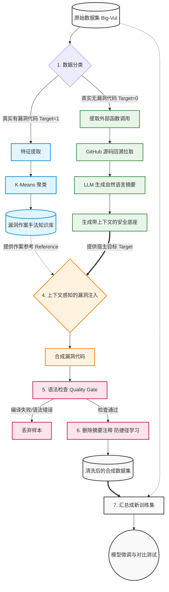

# 基于跨函数上下文与生成式数据增强的漏洞检测模型优化研究思考

@郭峻齐 https://lamaper.github.io

## 〇、 近期学习进展

VulScribeR 代码复现失败，这个项目依赖关系复杂，执行条件苛刻，并且依赖于jupyter记事本导致无法自动化进行实验，在尝试了三天后依然没有结果，遂放弃。

现在通过学习和模仿其代码，我自己重构了一个简单的流程脚本，能够在一定程度上复刻这个论文的思路。

## 一、 研究背景与动机

当前基于深度学习的漏洞检测面临两大核心痛点：

1. **数据稀缺性**：真实的高质量漏洞样本极少，导致模型训练面临严重的数据不平衡。
2. **上下文缺失**：为保证可扩展性，现有检测多在函数级别进行 ，导致模型丢失了关键的跨函数（Inter-procedural）调用语义 。

针对论文VulScribeR和VulnSC的研究，可以试着提出一种上下文感知的生成式数据增强框架。我们将 VulnSC（解决跨函数语义缺失）与 VulScribeR/VSR（解决数据量不足）进行深度融合，实现“高质量”与“大规模”的双重增强。

## 二、 核心研究流程

本研究的整体流水线分为以下五个关键步骤：

1. **基础数据准备**：选用业界权威的 C/C++ 漏洞数据集（如 Big-Vul 或 Devign）。将其划分为“无漏洞代码”（Safe）和“有漏洞代码”（Vulnerable）。
2. **针对无漏洞代码，基于 VulnSC 进行上下文增强**：
   - 提取无漏洞代码中的外部函数调用关系。
   - 自动从 GitHub 对应历史提交中拉取外部函数源码 ，利用 LLM 生成自然语言摘要 。
   - 将摘要以注释形式注入到无漏洞代码头部 ，形成“携带全局视角的安全底座”。
3. **针对有漏洞代码，基于 VSR 进行漏洞模式提取**：
   - 提取真实的漏洞代码样本，将其向量化。
   - 通过聚类算法（K-Means）将真实漏洞分为不同的模式簇（如 SQL注入、越界访问等），构建多样化的“漏洞知识库”。
4. **上下文感知的漏洞注入**：
   - 核心生成阶段：利用 RAG 技术，从知识库中检索出与当前底座匹配的真实漏洞作为“参考”。
   - 提示词工程：引导 LLM 阅读无漏洞底座上的“外部函数摘要注释”，在**严格遵循全局调用逻辑**的前提下，将参考漏洞的特征“移植”到底座中，生成逻辑严密的新漏洞样本。
5. **反捷径学习清洗与模型评估**：
   - **清洗**：在将合成数据放入最终训练集前，**利用脚本强制剔除所有由 VulnSC 生成的注释摘要**。
   - **训练与对比**：利用“原始数据”与“合并增强后的纯代码数据”分别微调 CodeBERT 等检测模型，对比 F1-Score 等指标，验证增强数据的有效性。

## 三、 关键技术特征剖析

### 1. 为什么 VulnSC 要去 GitHub 拉代码并生成摘要？

代码库是动态演进的，只有利用漏洞数据集自带的 Project Name 和 Commit ID 检出具体的历史版本 ，才能还原漏洞发生时最真实的调用图和外部函数逻辑 。此外，如果直接把所有外部源码拼接给检测模型，会导致输入序列过长、内存爆炸 。利用 LLM 将外部源码压缩为行为摘要 ，能在不显著增加样本体积的前提下，引入跨函数语义 。

### 2. 为什么 VSR 必须引入 RAG 检索和 K-Means 聚类？

如果直接让 LLM 凭空生成漏洞，它往往只会生成结构死板、类型单一（如简单的 `gets()` 溢出）的玩具代码。通过聚类确保了漏洞模式的全面覆盖；通过 RAG 强制 LLM 模仿真实的漏洞作案手法，配合无漏洞业务代码（Target），实现了“真实业务逻辑+真实漏洞特征”的高隐蔽性融合。

## 四、 潜在风险与缓解策略 

在推进过程中，可能面临以下学术与工程风险：

- **风险 1：检测模型的“捷径学习”**
  - 如果检测模型（如 CodeBERT）看到了提示摘要，它可能停止学习代码的控制流/数据流结构，转而死记硬背注释里的特定单词（如 "not check"），导致在真实测试集上效果崩盘。
  - **缓解策略**：在数据预处理的最后一步执行**“过河拆桥”机制**。合成具有高度连贯逻辑的漏洞代码后，严格清洗掉所有辅助生成的注释，迫使检测模型只从纯代码的 AST/DFG 特征中学习复杂的上下文漏洞逻辑。
- **风险 2：LLM 生成代码质量不可控，引入噪声**
  - **描述**：LLM 可能会被复杂的 Prompt 绕晕，生成存在基础语法错误或破坏原有外部调用的“废代码”。
  - **缓解策略**：引入质量检测。生成后，通过 GCC 进行轻量级可编译性检查，或利用 Joern 工具进行基本的 AST 解析。只有语法完备的代码才允许进入最终混合训练集；同时在前期开展小规模的 Pilot Study（先跑 50 条）以精调 Prompt。
- **风险 3：整体指标提升不显著**
  - **描述**：合并训练后，可能出现整体 F1-Score 仅微弱提升的情况，不足以证明改进具有显著性。
  - **缓解策略**：如果整体性能瓶颈难以突破，可以试着将评估重心转移至（1）**特定复杂漏洞类型**（如高度依赖跨函数交互的空指针解引用或资源泄漏），展示本方法在复杂漏洞上的巨大优势；（2）**跨项目泛化能力**测试，证明引入上下文语义增强后的模型在面对未知项目时鲁棒性更强。

## 五、 工程实现瓶颈与数据处理的极致优化策略 

在明确了理论框架与实验流水线后，我发现在落地实操阶段面临着一个巨大的工程挑战：离线数据准备阶段的极端 I/O 消耗。

具体而言，VulnSC 的上下文提取机制要求脚本根据数据集（如 Big-Vul）提供的元数据，去 GitHub 上精准回溯并检出海量 C/C++ 开源项目（如 Linux Kernel、FFmpeg 等）的历史提交版本。如果按照原始数据集的乱序状态进行简单的顺序处理，将会导致脚本在不同的庞大代码仓库之间频繁切换、重复克隆，产生灾难性的网络延迟与磁盘读写开销，使得**数据生成的时间成本远大于模型训练的成本**。

为了彻底突破这一算力与时间的瓶颈，我觉得可以设计一套“分层抽样与全局排序相结合”的极致优化流水线。首先，在工程执行层面，我们采用**“按项目与提交号全局排序”**的批处理策略。通过将待处理的样本队列严格按照“项目名称”进行主排序，并以“提交号”进行次排序，我们彻底改变了爬虫脚本的访问轨迹。执行脚本在下载某一大型仓库后，会利用本地 Git 极速的版本切换能力，连续且集中地提取该项目下所有样本的跨函数源码。待该项目所有数据榨干后，再清理磁盘并转向下一个项目。配合 Git 的无 Blob 浅克隆（`--filter=blob:none`）技术，该策略能将原本需要数月的数据收集时间压缩至一到两天。

然而，在追求极致工程效率的同时，必须警惕并规避深度学习中致命的**“项目偏见”**陷阱。如果为了最大化节省拉取时间，而单纯截取同一大型项目（或极少数几个代码库）内的连续代码段作为全部数据集，下游的检测模型将会严重过拟合于该特定项目的代码风格、宏定义习惯（如特定的内存分配函数名）以及变量命名规范。这种数据分布的极度倾斜会导致模型在面对真实世界中其他未知项目的野生代码时，泛化能力彻底崩溃。

因此，我认为还要采用**“采样与处理物理隔离”**的破局方案。在排序执行之前，我们首先在全局维度执行**严格的均衡分层抽样**。通过对 Big-Vul 全量数据按项目进行分组（Group by），我们强行限定单一项目的数据抽取上限，确保最终选出的核心子集（如 10,000 条样本）广泛覆盖数十甚至上百个截然不同的开源生态，从而保障了极高的数据多样性。在此基础上，我们仅对这批经过精心抽样的“高泛化能力子集”执行前述的全局排序拉取。这一套混合策略，既保证了最终模型在跨项目测试中具备强悍的鲁棒性，又在工程底座上实现了代码回溯与摘要生成效率的百倍提升。